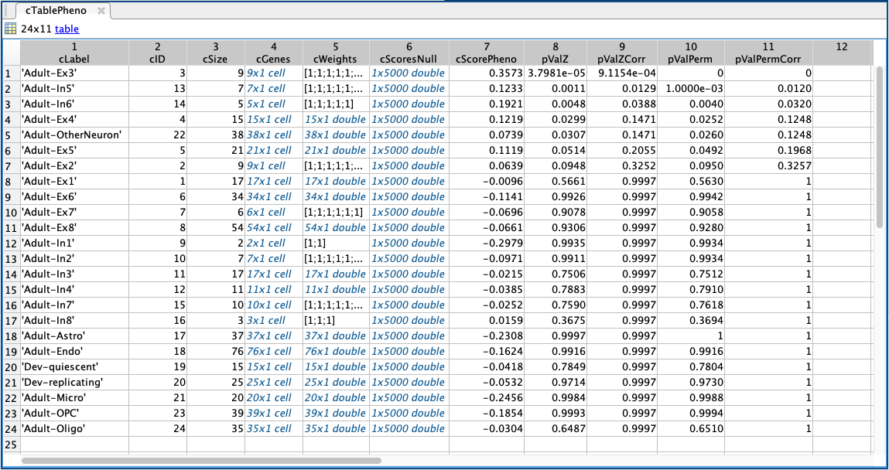
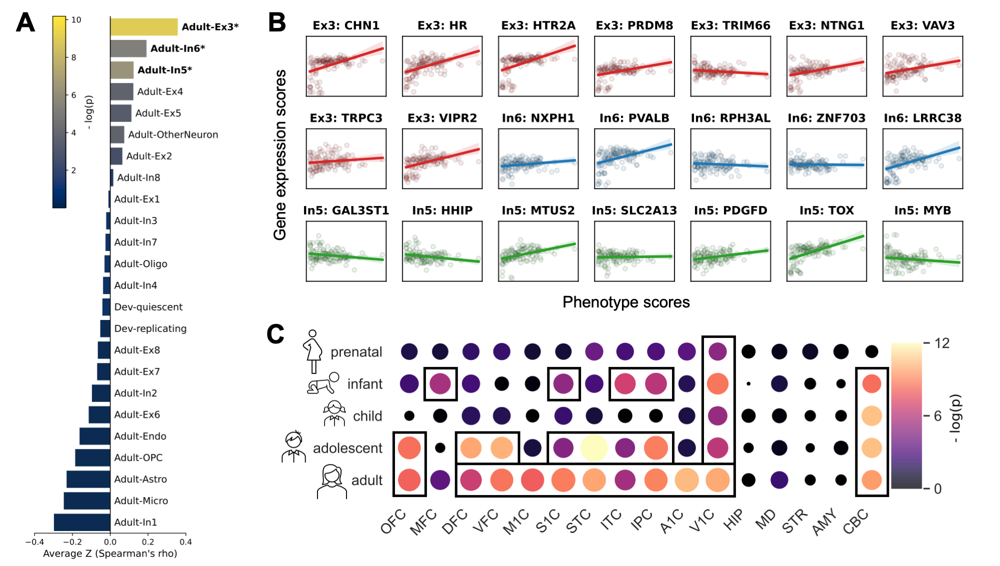

# <a name="top"></a>ABAnnotate - a toolbox for ensemble-based multimodal gene-category enrichment analysis of human neuroimaging data

*Are you interested in contextualising brain maps, maybe derived from case-control-comparisons, fMRI tasks, or spatial meta-analysis, across biological systems ranging from molecular and cell levels to disease-associations? ABAnnotate uses spatial gene expression patterns to derive neuroimaging phenotype-gene associations and asses the overrepresentation of associated genes in several multimodal gene-category datasets.* 

DOI: *Insert here*

[](https://www.gnu.org/licenses/gpl-3.0.en.html)  
<font size="1">(Note: *ABAnnotate* inherited its license from its [source toolbox](https://github.com/benfulcher/GeneCategoryEnrichmentAnalysis). Integrated datasets, especially data from the Allen Institute for Brain Science, are licensed under non-commercial licenses which is to be considered when using *ABAnnotate*.)</font>

---

*ABAnnotate* is a Matlab-based toolbox to perform ensemble-based gene-category enrichment analysis (GCEA) on volumetric human neuroimaging data via brain-wide gene expression patterns derived from the Allen Human Brain Atlas (ABA). It applies a nonparametric method developed by [Fulcher et al. (2021)](https://doi.org/10.1038/s41467-021-22862-1) using spatial autocorrelation-corrected phenotype null maps for the estimation of gene-category null ensembles. *ABAnnotate* was adopted from [Fulcher et al.`s toolbox](https://github.com/benfulcher/GeneCategoryEnrichmentAnalysis) which was originally designed for annotation of imaging data to [GeneOntology](http://geneontology.org/) categories. The function to generate null models, along with some utility functions, were taken from the [JuSpace](https://github.com/juryxy/JuSpace) toolbox by [Dukart et al. (2021)](https://doi.org/10.1002/hbm.25244).

*ABAnnotate* is under development. It works but you may well encounter bugs when using it. Please feel free to report these by opening an issue or contacting me.

---

## Content:  
- [Method](#method)  
- [Datasets](#datasets)
- [Dependencies](#depend)
- [Usage](#usage)
  - [Simple](#usage_simple)
  - [Advanced](#usage_advanced)
  - [Output](#usage_output)
  - [Example visualizations](#usage_vis)
  - [Working example](#usage_example)
- [What to cite](#cite)

---

## <a name="method"></a>Method 

The method basically consists of the following steps:

1. An input volume ("phenotype") is parcellated according to given parcellation and null models corrected for spatial-autocorrelation are generated.  
2. For each null phenotype and each gene category a "category score" is obtained by correlating the null phenotype with the spatial mRNA expression pattern of each gene and averaging the z-transformed correlation coefficients off all genes annotated to a certain category within each category (= null categories).  
3. The generated null category scores are then compared to the "real" category score obtained by correlating the "real" phenotype with all genes in each category and averaging the correlation coefficients per category.  
4. One-sided p values for each category are obtained from the estimated null distribution of category scores and the resulting p-values are FDR-corrected.  

*ABAnnotate* extends Fulcher et al.'s toolbox by:

1. shifting the focus away from GeneOntology categories to an independent form allowing for the integration of any dataset annotating genes to some kind of categories and  
2. increasing user-friendliness through integration of brain parcellations, associated ABA mRNA expression data, automated neuroimaging null volume generation, and multiple GCEA datasets annotating genes to functional, disease-related, developmental, and neurobiological categories.

## <a name="datasets"></a>Datasets

All datasets (atlases, ABA data, GCEA datasets) are stored on an [OSF server](https://osf.io/nvcmf/). Source information is provided in [`dataset_sources.csv`](/dataset_sources.csv) which can be loaded and updated from OSF via:

```matlab
sources_table = abannotate_get_sources;
```

*ABAnnotate* automatically downloads selected datasets to the two folders `\atlas` and `\datasets`.   
The toolbox relies heavily on [ABA data](https://portal.brain-map.org/) which was imported through the [abagen toolbox](https://abagen.readthedocs.io/) using the default settings.  
Currently, three parcellations are implemented: A functionally defined parcellation combined from 100 cortical ([Schaefer et al., 2018](https://doi.org/10.1093/cercor/bhx179)) and 16 subcortical parcels ([Tian et al., 2020](https://doi.org/10.1038/s41593-020-00711-6)), a second version of this parcellation with only the 100 cortical parcels, and the anatomically defined whole-brain [Neuromorphometrics](http://www.neuromorphometrics.com/) atlas (8 regions without ABA data (31, 72, 118, 121, 148, 149, 156, 174) were removed: 111 parcels).  
Current GCEA datasets include: 

- [GeneOntology](http://geneontology.org/) categories derived via [DAVID](https://david.ncifcrf.gov/)
- [DisGeNET](https://www.disgenet.org/downloads) gene-disease associations
- [BrainSpan](https://www.brainspan.org/) developmental brain-regional expression patterns adopted from [ABAEnrichment](http://bioconductor.org/packages/release/data/experiment/html/ABAData.html)
- [PsychEncode](http://resource.psychencode.org/) neuronal cell type markers  
- Chromosomal and cytogenic gene locations derived from [DAVID](https://david.ncifcrf.gov/)


To get a list of all available datasets run:
 
```matlab
abannotate_get_datasets;
```

Output: 

```
Available GCEA datasets:
- ABA-brainSpan-weights
- DAVID-chromosome-discrete
- DAVID-cytogenicLocation-discrete
- DisGeNET-diseaseCuratedAll-discrete
- DisGeNET-diseaseCuratedMental-discrete
- DisGeNET-diseaseAllAll-discrete
- DisGeNET-diseaseAllMentalBehav-discrete
- GO-biologicalProcessDirect-discrete
- GO-biologicalProcessProp-discrete
- GO-molecularFunctionDirect-discrete
- GO-molecularFunctionProp-discrete
- GO-cellularComponentDirect-discrete
- GO-cellularComponentProp-discrete
- PsychEncode-cellTypesTPM-discrete
- PsychEncode-cellTypesUMI-discrete
```

Please note that, while *ABAnnotate* is published under a [GPL-3.0](https://www.gnu.org/licenses/gpl-3.0.en.html) license which allows for commercial use, associated datasets are protected by other licences (e.g., ABA data may not be used commercially, DisGeNET data are protected under a [CC BY-NC-SA 4.0](https://creativecommons.org/licenses/by-nc-sa/4.0/) license). If available, these licensed are listed in [`dataset_sources.csv`](dataset_sources.csv). _This effectively renders *ABAnnotate*, if used as is, unsuitable for commercial use!_

## <a name="depend"></a>Dependencies

*ABAnnotate* was coded in Matlab R2021a. For generation of phenotype null maps, it depends on the [SPM12](https://www.fil.ion.ucl.ac.uk/spm/software/spm12/) image calculator. It uses the Parallel Processing toolbox for generation of null phenotypes and correlation calculation. It requires an internet connection to download parcellations, ABA data and GCEA datasets from OSF.

## <a name="usage"></a>Usage

### <a name="usage_simple"></a>Simple

The simplest use case requires only a NIfTI volume in MNI space and the selection of one of the GCEA datasets provided with *ABAnnotate*. The below code will perform a GCEA on an input volume with 1000 null maps corrected for spatial autocorrelation using GeneOntology "Biological Process" categories with annotated genes propagated upwards through the GeneOntology hierarchy (as opposed to only using direct annotations between categories and genes); phenotype-gene associations will be computed using Spearman correlations and category scores will estimated as average r-to-Z-transformed correlation coefficients.

Download the toolbox and add it to the matlab path:

```matlab
startup;
```

All Options are defined in a `struct` array:

```matlab
opt = struct();
opt.analysis_name = 'GCEA_GeneOntology'; % name for analysis
opt.phenotype = '/path/to/input/volume.nii'; % input "phenotype" volume
opt.dir_result = '/path/to/save/output'; % output directory
opt.GCEA.dataset = 'GO-biologicalProcessProp-discrete'; % selected GCEA dataset
```

Run:

```matlab
results_table = ABAnnotate(options);
```


### <a name="usage_advanced"></a>Advanced

You can define various options and provide precomputed data (see below). You can also use your own parcellation, but will then have to generate a custom ABA gene expression dataset. All options are shown in [`example/customization.md`](example/example_customization.md). 

```matlab
opt = struct();
opt.analysis_name = 'GCEA_GeneOntology'; % name for analysis
opt.phenotype = '/path/to/input/volume.nii'; % input "phenotype" volume
opt.phenotype_nulls = '/path/to/precomputed/phenotype_nulls.mat'; % use already computed phenotype nulls
opt.n_nulls = 1000; % number of null phenotypes/categories, will be overwritten with n nulls from .phenotype_nulls
opt.atlas = 'SchaeferTian'; % one of {'SchaeferTian', 'Neuromorphometrics', 'Schaefer'} 
opt.dir_result = '/path/to/save/output'; % output directory
opt.GCEA.dataset = 'GO-biologicalProcessProp-discrete'; % selected GCEA dataset
opt.GCEA.size_filter = [5, 200]; % select categories with between 5 and 200 annotated genes
opt.GCEA.correlation_method = 'Spearman';  % one of {'Spearman', 'Pearson'}
opt.GCEA.aggregation_method = 'mean'; % one of {'mean', 'absmean', 'median', 'absmedian', 'weightedmean', 'absweightedmean'}
opt.GCEA.p_tail = 'right'; % one of {'right', 'left'}
```

*ABAnnotate* can incorporate "continuous" GCEA datasets with gene expression values across the whole genome for each category. This currently applies only to the BrainSpan dataset. You can choose your own thresholding settings to define marker genes and weight each gene-phenotype correlation by the gene's expression value when calculating category scores:

```matlab
opt = struct():
opt.analysis_name = 'GCEA_BrainSpan'; % name for analysis
opt.phenotype = '/path/to/input/volume.nii'; % input "phenotype" volume
opt.dir_result = '/path/to/save/output'; % output directory
opt.GCEA.dataset = 'ABA-brainSpan-weights'; % selected GCEA dataset
opt.GCEA.aggregation_method = 'weightedmean'; % one of {'mean', 'absmean', 'median', 'absmedian', 'weightedmean', 'absweightedmean'}
opt.GCEA.weights_quant = 0.90; % retain only genes with expression values > 0.9th quantile of the whole dataset
opt.GCEA.weights_cutoff = false; % if true, binarize expression values -> standard mean will be calculated. If false, use weighted mean
opt.GCEA.gene_coocc_thresh = 0.2; % retain only genes annotated to 20% or less of categories after weight thresholding
```

Default GCEA options are imported from [gcea\_default\_settings.m](scripts/gcea_default_settings.m). 

### <a name="usage_output"></a>Output
*ABAnnotate*'s main output consists of a table with as many rows as there are categories in the current dataset.  
Below you see an example output from the neuronal cell type dataset (transcripts per kilobase million; TPM). Here, we have marker sets for 24 cell types (Ex/In = excitatory/inhibitory neuron subclasses; see [Lake et al. (2016)](https://doi.org/10.1126/science.aaf1204) for detailed information). The three top categories are significant at FDR-corrected p < .05 using the nonparametric procedure.

`cLabel` = category name; `cDesc` = category descriptions; `cSize` = number of genes annotated to category; `cGenes` = official gene symbols; `cWeights` = expression values for each gene, will be vector of ones if discrete dataset (most cases); `cScoresNull` = null category scores (here, 5000 null samples); `cScorePheno` = e.g., mean of r-to-z-transformed phenotype-gene Spearman correlation coefficients for all genes in category; `pValPerm` = exact p-value derived from the null distribution of category scores; `pValPermCorr` = FDR-corrected "q"-value; `pValZ(Corr)` = p-value derived from Z-distribution fitted to the null data to approximate very small p-values.



Output files: A .mat-file with the table (see above) and the input options struct, a .csv-file with a reduced version of the table, a .xml file generated from the options struct, and a log file with the matlab terminal output.

### <a name="usage_vis"></a>Example visualizations

A/B: neuroimaging phenotype — neuronal cell type associations (see table above); A: bars representing category scores, color showing the negative base 10 logarithm of the uncorrected p-values derived from the z-distribution, \*FDR-significant (nonparametric); B: gene-wise spatial correlation patterns for each gene annotated to one of the three significantly associated cell types.  
C: neuroimaging phenotype — developmental brain-regional gene expression (BrainSpan); point size representing category scores, color showing the negative base 10 logarithm of the uncorrected p-values derived from the z-distribution, squares mark FDR-significant (nonparametric) categories.



### <a name="usage_example"></a>Working Example

In [`example/example_pain.md`](example/example_pain.md), I provide exemplary analyses using *ABAnnotate* to relate a meta-analytic brain map of pain processing to the integrated neuronal cell type markers, BrainSpan, and GeneOntology "biological process" datasets. In [`example/customization.md`](example/example_customization.md), I line out several implemented customization options.

## <a name="cite"></a>What to cite

If you use ABAnnotate in publications, please cite the following sources:

- In any case:
  - [Fulcher et al. (2021)](https://doi.org/10.1038/s41467-021-22862-1). Overcoming false-positive gene-category enrichment in the analysis of spatially resolved transcriptomic brain atlas data. *Nature Communications*.
  - [Lotter et al. (2022)](link). ABAnnotate: A Toolbox for Multimodal Gene-Category Enrichment Analysis of Human Neuroimaging Data. *Zenodo*.
- If you use the integrated ABA datasets:
  - [Hawrylycz et al. (2015)](https://doi.org/10.1038/nn.4171). Canonical genetic signatures of the adult human brain. *Nature Neuroscience*.
  - [Markello et al. (2021)](https://doi.org/10.7554/eLife.72129) Standardizing workflows in imaging transcriptomics with the abagen toolbox. *eLife*.
- If you use the implemented method for spatial null model generation:
  - [Dukart et al. (2021)](https://doi.org/10.1002/hbm.25244). JuSpace: A tool for spatial correlation analyses of magnetic resonance imaging data with nuclear imaging derived neurotransmitter maps. *Human Brain Mapping*.
  - [Burt et al. (2018)](https://doi.org/10.1038/s41593-018-0195-0). Hierarchy of transcriptomic specialization across human cortex captured by structural neuroimaging topography. *Nature Neuroscience*.
- If you use the integrated volumetric parcellations:
  - [Schaefer et al. (2018)](https://doi.org/10.1093/cercor/bhx179). Local-Global Parcellation of the Human Cerebral Cortex from Intrinsic Functional Connectivity MRI. *Cerebral Cortex*.
  - [Tian et al. (2020)](https://doi.org/10.1038/s41593-020-00711-6). Topographic organization of the human subcortex unveiled with functional connectivity gradients. *Nature Neuroscience*.
- If you use the GeneOntology GCEA datasets: 
  - [Ashburner et al. (2000)](https://doi.org/10.1038/75556). Gene Ontology: tool for the unification of biology. *Nature Genetics*.
  - [The Gene Ontology Consortium et al. (2021)](https://doi.org/10.1093/nar/gkaa1113). The Gene Ontology resource: enriching a GOld mine. *Nucleic Acids Research*.
  - [Huang et al. (2009)](https://doi.org/10.1038/nprot.2008.211). Systematic and integrative analysis of large gene lists using DAVID bioinformatics resources. *Nature Protocols*.
  - [Huang et al. (2009)](https://doi.org/10.1093/nar/gkn923). Bioinformatics enrichment tools: paths toward the comprehensive functional analysis of large gene lists. *Nucleic Acids Research*.
- If you use the DisGeNET datasets:
  - [Piñero et al. (2020)](https://doi.org/10.1093/nar/gkz1021). The DisGeNET knowledge platform for disease genomics: 2019 update. *Nucleic Acids Research*.
- If you use the BrainSpan dataset:
  - [Miller et al. (2014)](https://doi.org/10.1038/nature13185). Transcriptional Landscape of the Prenatal Human Brain. *Nature*.
  - [Grote et al. (2016)](https://doi.org/10.1093/bioinformatics/btw392). ABAEnrichment: an R package to test for gene set expression enrichment in the adult and developing human brain. *Bioinformatics*.
- If you use the cell markers datasets:
  - [Wang et al. (2018)](https://doi.org/10.1126/science.aat8464). Comprehensive functional genomic resource and integrative model for the human brain. *Science*.
  - Markers based on transcripts per kilobase million (TPM):
     - [Lake et al. (2016)](https://doi.org/10.1126/science.aaf1204). Neuronal subtypes and diversity revealed by single-nucleus RNA sequencing of the human brain. *Science*.
     - [Darmanis et al. (2015)](https://doi.org/10.1073/pnas.1507125112). A survey of human brain transcriptome diversity at the single cell level. *PNAS*.
  - Markers based on unique molecular identifiers (UMI):
     - [Lake et al. (2018)](https://doi.org/10.1038/nbt.4038). Integrative single-cell analysis of transcriptional and epigenetic states in the human adult brain. *Nature Biotechnology*.


## <a name="contact"></a>Contact
If you have questions, comments or suggestions, or would like to contribute to the toolbox, open an issue or [contact me](mailto:leondlotter@gmail.com)! 


## To do
- run thorough testing
- add detailed documentation
- more examples
- add visualization functions
- more atlases
- more datasets
- add functions to create volumes from GCEA datasets

---
[Back to the top](#top)


