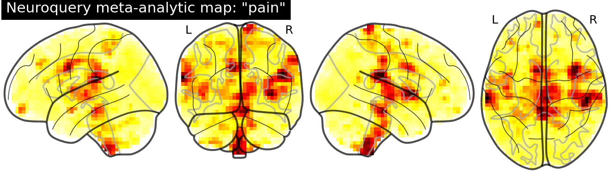
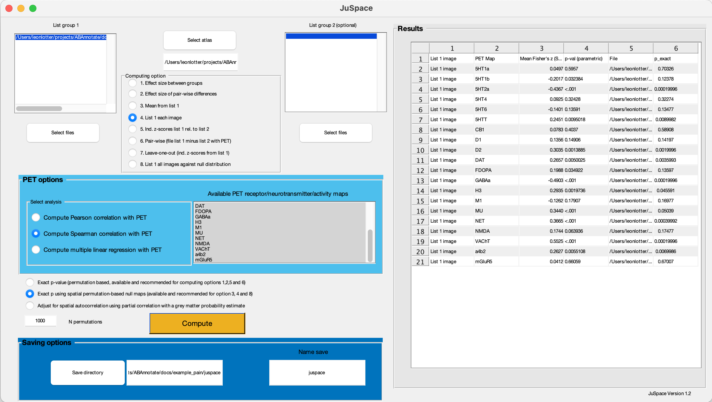
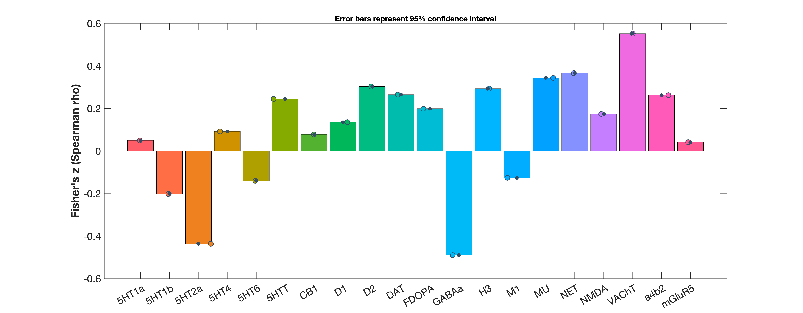
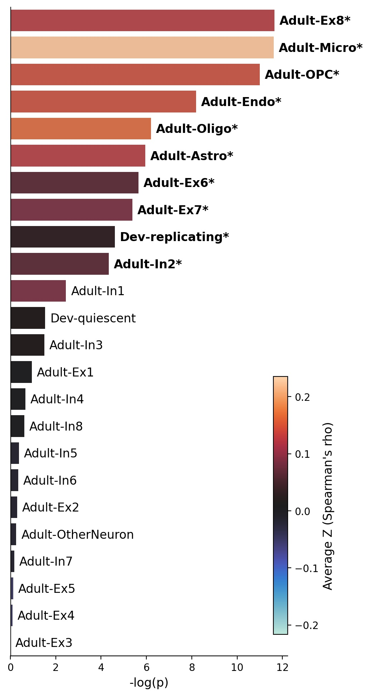
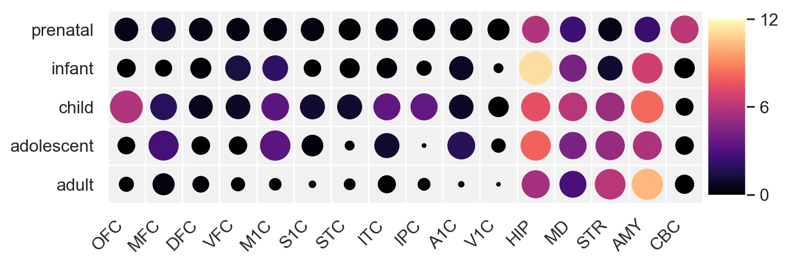
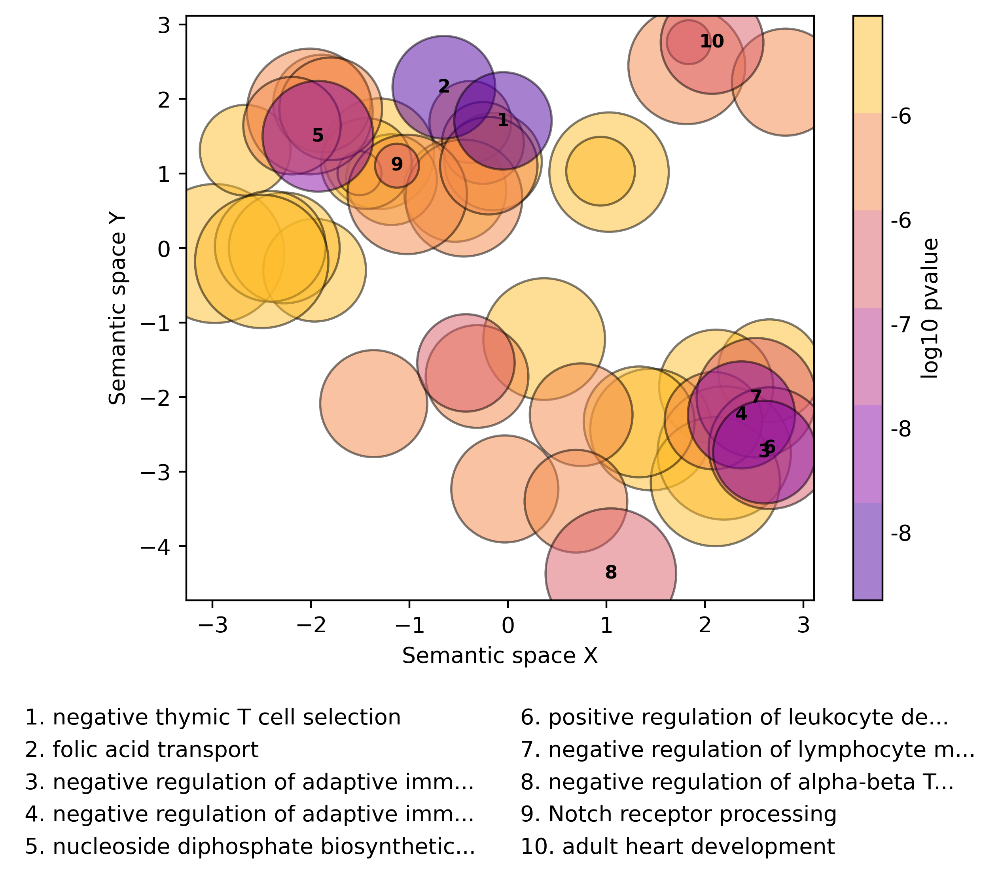

# ABAnnotate Example Use Case: 

## Neuronal cell type, developmental gene expression patterns and biological processes associated with neuronal pain processing

Here, we use *ABAnnotate* to contextualize a whole-brain map of brain activation generated from the scientific literature on "pain" via [NeuroQuery](https://neuroquery.org/query?text=pain).  
I will use python code for visualization as I had the respective code ready to use.

---

### Content:
- [Neurotransmitter associations](#nt)
- [Neuronal cell types](#cells)
- [Brain regional gene expression across development](#dev)
- [Biological processes](#go)

---

Let's take a look at our brain map:

```python
from nilearn.plotting import plot_glass_brain

z_plot = plot_glass_brain('neuroquery_pain.nii', display_mode='lyrz', title='Neuroquery meta-analytic map: "pain"')
z_plot.savefig('img/brainplot.png', dpi=150)
```



Convincingly, we see the strongest activations in somatosensory cortices, midline structures, thalami, and brainstem. 

### <a name="nt"></a>Neurotransmitter associations

Before we start using *ABAnnotate*, let see whether the distribution of pain-related brain activation spatially associates with distributions of neurotransmitter systems as measures using nuclear imaging. We can use [JuSpace](https://github.com/juryxy/JuSpace) to achieve that. JuSpace incorporates many nuclear imaging maps, I, however, used an own collection of neurotransmitter maps I combined from different sources. It is mainly GUI-based, which looks like this:  



In the below bar plot, bars show r-to-Z-transformed Spearman coefficients between the pain map and each transmitter map parcellated using a functional 116-parcel atlas:



We see that several transmitter receptors seem to be spatially associated, but the strongest association is found between the acetylcholine transporter and pain-related brain activation. A role of Ach in pain modulation was indeed discussed in the literature but I'll leave it to you to do with this what you will :).

### <a name="cells"></a>Neuronal cell types

Now let's move to *ABAnnotate*. We start with looking at markers for neuronal cell types. We choose the TPM (transcripts per kilobase million) dataset which entails 24 different neuronal cell types, most of them subtypes of inhibitory or excitatory neurons. The dataset itself looks like this:  

```matlab
load(get_gcea_dataset('PsychEncode-cellTypesTPM-discrete'), 'cTable')
disp(cTable)
```

```
           cLabel            cID    cSize      cGenes   
    _____________________    ___    _____    ___________

    {'Adult-Ex1'        }     1      18      {18×1 cell}
    {'Adult-Ex2'        }     2      11      {11×1 cell}
    {'Adult-Ex3'        }     3       9      { 9×1 cell}
    {'Adult-Ex4'        }     4      17      {17×1 cell}
    {'Adult-Ex5'        }     5      21      {21×1 cell}
    {'Adult-Ex6'        }     6      38      {38×1 cell}
    {'Adult-Ex7'        }     7       6      { 6×1 cell}
    {'Adult-Ex8'        }     8      65      {65×1 cell}
    {'Adult-In1'        }     9       2      { 2×1 cell}
    {'Adult-In2'        }    10       7      { 7×1 cell}
    {'Adult-In3'        }    11      20      {20×1 cell}
    {'Adult-In4'        }    12      11      {11×1 cell}
    {'Adult-In5'        }    13      11      {11×1 cell}
    {'Adult-In6'        }    14       6      { 6×1 cell}
    {'Adult-In7'        }    15      13      {13×1 cell}
    {'Adult-In8'        }    16       4      { 4×1 cell}
    {'Adult-Astro'      }    17      40      {40×1 cell}
    {'Adult-Endo'       }    18      83      {83×1 cell}
    {'Dev-quiescent'    }    19      17      {17×1 cell}
    {'Dev-replicating'  }    20      40      {40×1 cell}
    {'Adult-Micro'      }    21      25      {25×1 cell}
    {'Adult-OtherNeuron'}    22      46      {46×1 cell}
    {'Adult-OPC'        }    23      53      {53×1 cell}
    {'Adult-Oligo'      }    24      35      {35×1 cell}
```

`cLabel` is the category label, `cGenes` a cell vector with the official gene symbols of annotated genes, and `cSize` the length of this vector. Looking in at one of this vectors, we can inspect the annotated genes:

```matlab
disp(cTable.cGenes{1})
```

```
    {'HPCAL1'  }
    {'LAMP5'   }
    {'SERPINE2'}
    {'CDH9'    }
    {'GNAL'    }
    {'CCDC88C' }
    {'PCDH8'   }
    {'PDGFD'   }
    {'GREB1L'  }
    {'MDGA1'   }
    {'JAG1'    }
    {'GPR83'   }
    {'NECAB2'  }
    {'MN1'     }
    {'CAMK2A'  }
    {'DNM1'    }
    {'KCNK1'   }
    {'KCNV1'   }
```

Now let's run the gene-category enrichment analysis with our pain map:

```matlab
opt.analysis_name = 'pain_celltypes';
opt.n_nulls = 1000;
opt.phenotype = 'neuroquery_pain.nii';
opt.dir_result = 'gcea';
opt.GCEA.dataset = 'PsychEncode-cellTypesTPM-discrete';

cTable_celltypes = ABAnnotate(opt);
```

Print significant cell type associations:

```matlab
disp(cTable_celltypes(cTable_celltypes.pValPermCorr<0.05, :))
```

```
          cLabel           cID    cSize      cGenes         cWeights         cScoresNull      cScorePheno      pValZ       pValZCorr     pValPerm    pValPermCorr
    ___________________    ___    _____    ___________    _____________    _______________    ___________    __________    __________    ________    ____________

    {'Adult-Ex8'      }     8      54      {54×1 cell}    {54×1 double}    {1×1000 double}      0.13337       8.749e-06    0.00010916         0               0  
    {'Adult-Micro'    }    21      20      {20×1 cell}    {20×1 double}    {1×1000 double}       0.2351      9.0968e-06    0.00010916         0               0  
    {'Adult-OPC'      }    23      39      {39×1 cell}    {39×1 double}    {1×1000 double}      0.15778      1.6631e-05    0.00013305         0               0  
    {'Adult-Endo'     }    18      76      {76×1 cell}    {76×1 double}    {1×1000 double}      0.16293      0.00027777     0.0016666         0               0  
    {'Adult-Oligo'    }    24      35      {35×1 cell}    {35×1 double}    {1×1000 double}      0.17779       0.0020334     0.0097603     0.001          0.0048  
    {'Adult-Astro'    }    17      37      {37×1 cell}    {37×1 double}    {1×1000 double}      0.13854       0.0025856      0.010342     0.003           0.012  
    {'Adult-Ex6'      }     6      34      {34×1 cell}    {34×1 double}    {1×1000 double}     0.087048       0.0034962      0.011987     0.004        0.013714  
    {'Adult-Ex7'      }     7       6      { 6×1 cell}    { 6×1 double}    {1×1000 double}     0.099423       0.0045834       0.01375     0.006           0.018  
    {'Dev-replicating'}    20      25      {25×1 cell}    {25×1 double}    {1×1000 double}      0.04583       0.0099681      0.026582     0.011        0.029333  
    {'Adult-In2'      }    10       7      { 7×1 cell}    { 7×1 double}    {1×1000 double}     0.069247        0.012961      0.031106     0.015           0.036  
```

We have several significantly associated cell types, most of them non-neuronal cells. Sorted by p-values, the two upmost categories are (1) an excitatory neuron class (Ex8) that was classified as corticothalamic projection neurons in the original study that identified our markers ([Lake et al., 2016](https://doi.org/10.1126/science.aaf1204)) and (2) microglia which have been indicated as having a role in chronic and neuropathic pain. 

Let us plot our result (again, in python). We plot the negative natural logarithm of the `pValZ` which are the uncorrected p-values derived from fitting a standard distribution to the permutation-derived null category scores. This is nice for plotting as the permutation derived p-values (`pValPerm`) will be cut at a certain low point given by the number of phenotype null maps (i.e., with 1000 null maps the minimum pValPerm would be p = 1/1000 = 0.001, everything lower will be p = 0). However, we use the FDR-corrected permuted p-values (`pValPermCorr`) to mark significance:

```python
import pandas as pd
import numpy as np
import matplotlib.pyplot as plt
import matplotlib as mpl
import seaborn as sns

# function to generate colors
def colors_from_values(values, palette_name):
    # normalize the values to range [0, 1]
    normalized = (values - min(values)) / (max(values) - min(values))
    # convert to indices
    indices = np.round(normalized * (len(values) - 1)).astype(np.int32)
    # use the indices to get the colors
    palette = sns.color_palette(palette_name, len(values))
    return np.array(palette).take(indices, axis=0)

# load data
cell = pd.read_csv('gcea/GCEA_pain_celltypes.csv')

# PLOT
fig, axes = plt.subplots(1,1, figsize=(5,12))
cell_plot = sns.barplot(data=cell, x=-np.log(cell.pValZ), y='cLabel', ax=axes, palette=colors_from_values(cell.cScorePheno, 'icefire'))

# labels
for i, p in enumerate(cell_plot.patches):
    x = p.get_x() + p.get_width()
    xy = (5, -15)
    label = cell.cLabel[i]+'*' if cell.pValPermCorr[i]<0.05 else cell.cLabel[i]
    weight = 'bold' if cell.pValPermCorr[i]<0.05 else 'normal'
    cell_plot.annotate(label, (x, p.get_y()), xytext=xy, textcoords='offset points', size=12, weight=weight)
# style
cell_plot.axvline(0, color='k', linewidth=1)
cell_plot.set_xlabel('-log(p)', fontsize=12)
cell_plot.set(yticklabels=[], ylabel=None)
cell_plot.tick_params(left=False)
sns.despine(fig, None, True, True, True, False)
# cbar
cb = plt.colorbar(mpl.cm.ScalarMappable(norm=mpl.colors.Normalize(vmin=cell.cScorePheno.min(), vmax=cell.cScorePheno.max()), 
                  cmap='icefire'), orientation='vertical', cax=fig.add_axes([0.86, 0.15, 0.04, 0.3]))
cb.set_label("Z (Spearman's rho'", size=12)
# save
plt.savefig('img/pain_cells.jpg', bbox_inches='tight', dpi=200)
```




### <a name="dev"></a>Brain regional gene expression across development

Second, we use the BrainSpan dataset to look at how genes associated to pain processing are regionally expressed through development. Here, we have gene expression data for 5 developmental stages and several brain regions. Here, the dataset included in *ABAnnotate* does not consist of markers but of the whole expression vector for each category and we will threshold it to "identify" markers:

```matlab
clear opt
opt.analysis_name = 'pain_brainspan';
opt.n_nulls = 1000;
opt.phenotype = 'neuroquery_pain.nii';
opt.dir_result = 'gcea';
opt.GCEA.dataset = 'ABA-brainSpan-weights';
opt.GCEA.weights_quant = 0.90; % this will only keep expression values > .9th quantile of the whole dataset
opt.GCEA.weights_cutoff = true; % this will lead to the expression values being binarized (as opposed to 
	% weighting each gene by its expression value when calculating category scores) 
opt.GCEA.gene_coocc_thresh = 0.2; % this will only keep genes annotated to < 20% of included categories

cTable_brainspan = ABAnnotate(opt);
``` 

Show significant:

```matlab
disp(cTable_brainspan(cTable_brainspan.pValPermCorr<0.05, :))
```

```
          cLabel                                 cDesc                            cSize       cGenes          cWeights         cScoresNull      cScorePheno      pValZ       pValZCorr    pValPerm    pValPermCorr
    __________________    ____________________________________________________    _____    ____________    ______________    _______________    ___________    __________    _________    ________    ____________

    {'infant_HIP'    }    {'infant - hippocampus (hippocampal formation)'    }      22     { 22×1 cell}    { 22×1 double}    {1×1000 double}      0.16938      1.3856e-05    0.0011085         0               0  
    {'adult_AMY'     }    {'adult - amygdaloid complex'                      }      40     { 40×1 cell}    { 40×1 double}    {1×1000 double}      0.12627      3.7257e-05    0.0014903         0               0  
    {'child_AMY'     }    {'child - amygdaloid complex'                      }      26     { 26×1 cell}    { 26×1 double}    {1×1000 double}      0.15256      0.00025758    0.0064304         0               0  
    {'adolescent_HIP'}    {'adolescent - hippocampus (hippocampal formation)'}      40     { 40×1 cell}    { 40×1 double}    {1×1000 double}      0.10534      0.00032152    0.0064304     0.001        0.013333  
    {'child_HIP'     }    {'child - hippocampus (hippocampal formation)'     }      79     { 79×1 cell}    { 79×1 double}    {1×1000 double}     0.083719      0.00058083    0.0092933         0               0  
    {'infant_AMY'    }    {'infant - amygdaloid complex'                     }      44     { 44×1 cell}    { 44×1 double}    {1×1000 double}      0.11135       0.0012115     0.016154     0.001        0.013333  
    {'prenatal_CBC'  }    {'prenatal - cerebellar cortex'                    }     149     {149×1 cell}    {149×1 double}    {1×1000 double}     0.063796       0.0021726      0.02083     0.002            0.02  
    {'child_MD'      }    {'child - mediodorsal nucleus of thalamus'         }     120     {120×1 cell}    {120×1 double}    {1×1000 double}     0.075168       0.0022485      0.02083     0.003            0.02  
    {'adult_STR'     }    {'adult - striatum'                                }     102     {102×1 cell}    {102×1 double}    {1×1000 double}      0.11446       0.0024469      0.02083     0.002            0.02  
    {'child_OFC'     }    {'child - orbital frontal cortex'                  }      11     { 11×1 cell}    { 11×1 double}    {1×1000 double}      0.15634        0.002839      0.02083     0.003            0.02  
    {'prenatal_HIP'  }    {'prenatal - hippocampus (hippocampal formation)'  }     221     {221×1 cell}    {221×1 double}    {1×1000 double}     0.052267       0.0028642      0.02083     0.006           0.032  
    {'adolescent_AMY'}    {'adolescent - amygdaloid complex'                 }      40     { 40×1 cell}    { 40×1 double}    {1×1000 double}     0.080687       0.0032044     0.021363     0.004        0.024615  
    {'adult_HIP'     }    {'adult - hippocampus (hippocampal formation)'     }      28     { 28×1 cell}    { 28×1 double}    {1×1000 double}     0.066221       0.0041274       0.0254     0.003            0.02  
    {'child_STR'     }    {'child - striatum'                                }     136     {136×1 cell}    {136×1 double}    {1×1000 double}     0.080186       0.0052105     0.029775     0.005        0.028571  
    {'adolescent_STR'}    {'adolescent - striatum'                           }      95     { 95×1 cell}    { 95×1 double}    {1×1000 double}     0.088436       0.0062246     0.033198     0.003            0.02  
```

Plot (python):

```python:
import pandas as pd
from heatmap import heatmap
import seaborn as sns
sns.set(color_codes=True, font_scale=1.1)

devel = pd.read_csv('gcea/GCEA_pain_brainspan.csv')
devel['age'] = [l.split('_')[0] for l in devel.cLabel]
devel['region'] = [l.split('_')[1] for l in devel.cLabel]

age_order = ['adult', 'adolescent', 'child', 'infant', 'prenatal']
region_order = ['OFC', 'MFC', 'DFC', 'VFC', 'M1C', 'S1C', 'STC', 'ITC', 'IPC', 
                'A1C', 'V1C', 'HIP', 'MD', 'STR', 'AMY', 'CBC']

plt.figure(figsize=(8, 2.5))
heatmap(x=devel['region'], y=devel['age'], y_order=age_order, x_order=region_order,
        color=-np.log(devel['pValZ']), size=devel['cScorePheno'], marker='o',
        palette=sns.color_palette('magma_r', 500)[::-1], color_range=(0,12))
plt.annotate('test', (2.2,0.5))
plt.savefig('img/pain_development.jpg', bbox_inches='tight', dpi=200)
```



It seems, pain-processing-related genes are subcortically expressed throughout development. This time, color represents the p-value and point size the category score.

### <a name="go"></a>Biological processes

Now that we have found these associations, wouldn't it be interesting to see in which biological functions the genes that mediate between our pain phenotype and the analyzed gene categories are actually involved? The actual "classical" use case of GCEA is the annotation of a phenotype to [GeneOntology](http://geneontology.org/) (GO) "biological process" categories which annotate genes to a large number of categories depicting sub-cellular processes. These categories are organized hierarchically and we have two options regarding the dataset: `GO-biologicalProcessDirect-discrete` entails only direct gene-GO-category annotations and `GO-biologicalProcessProb-discrete` uses annotations propagated up through the GO-hierarchy. We will use the latter:

```matlab
clear opt
opt.analysis_name = 'pain_biologicalprocesses';
opt.n_nulls = 1000;
opt.phenotype = 'neuroquery_pain.nii';
opt.dir_result = 'gcea';
opt.GCEA.dataset = 'GO-biologicalProcessProp-discrete';
opt.GCEA.size_filter = [5, 200]; % filter categories to those annotating between 5 and 200 genes.

cTable_biologicalprocesses = ABAnnotate(opt);
```

Usually, we get a large number of significantly associated categories with GO datasets:

```matlab
fprintf('total: %u, significant: %u', ...
    height(cTable_biologicalprocesses), ...
    height(cTable_biologicalprocesses(cTable_biologicalprocesses.pValPermCorr<0.05, :)))
```

```
total: 7805, significant: 2533
```

There are several available method to summarize lists of GO-category obtained from GCEA or similar methods. Here, I use [GO-Figure!](https://doi.org/10.3389/fbinf.2021.638255) to cluster GO-categories based on semantic similarity and visualize the result using multidimensional clustering:  

Export significant GO-categories for use in GO-Figure!:

```matlab
writetable(cTable_biologicalprocesses(cTable_biologicalprocesses.pValPermCorr<0.05, {'cLabel', 'pValZ'}), ...
    'gofigure/significant_biologicalprocesses.txt', ...
    'WriteVariableNames', false, ...
    'Delimiter', '\t')
```

Run GO-Figure! from terminal:

```
python /Users/leonlotter/projects/GO-Figure/gofigure.py -i ./gofigure/significant_biologicalprocesses.txt -o ./gofigure/ -n bpo -q png -w GCEA_pain_biologicalprocesses
```
 
Each point is a cluster of GO-categories, point size represents the number of categories in each cluster, point color the p-value associated with each cluster (obtained from `cTable.pValZ`), the distance between points shows the (dis-)similarity between categories, and the annotations show single GO-categories that habe been automatically selected as representative for each cluster.


  
We find an overwhelming association with functions related to immune response. Does this make sense? I'll leave that to you to find out!
  
For further customization options, see [`example_customization.md`](example_customization.md).  
Feel free to [contact me](mailto:leondlotter@gmail.com), if you have questions or run into issues!

 